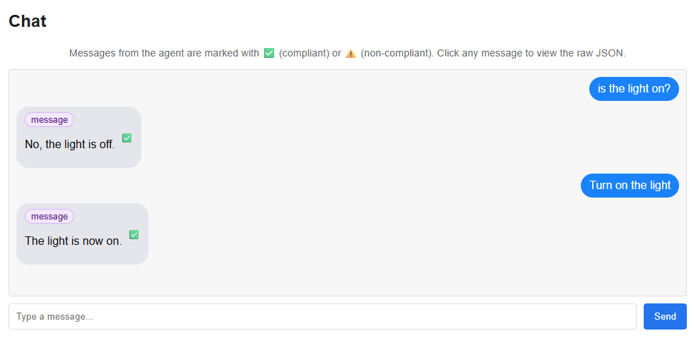

# agent-framework-sampler

[![[C]ontinuous [I]ntegration](https://github.com/percebus/semantic-kernel-sampler/actions/workflows/always.yml/badge.svg)](https://github.com/percebus/semantic-kernel-sampler/actions/workflows/always.yml)

~~Semantic-Kernel~~ `agent-framework` monorepo sampler

## Sub-Projecs/Repos

### REST API

- `node/`
  - [`rest-app`](./node/rest-app)

### Agents

- `dotnet/`
  - ~~[`SemanticKernelSampler.DotNet`](./dotnet/SemanticKernelSampler.DotNet)~~ `DEPRECATED` use `AgentFrameworkSampler.DotNet` instead
  - [`AgentFrameworkSampler.DotNet`](./dotnet/AgentFrameworkSampler.DotNet)
- `java/`
  - TODO
- `python/`
  - [`semantic-kernel-sampler-py`](./python/semantic-kernel-sampler-py): `DEPRECATED` use `agent-framework` instead
  - [`agent-framework-sampler-py`](./python/agent-framework-sampler-py)

### MCP

- `node/`
  - [`mcp-server.examples.quick-start`](./node/mcp-server.examples.quick-start)
  - [`mcp-server.rest-app.posts`](./node/mcp-server.rest-app.posts)
    - Uses [`rest-app`](./node/rest-app)

### AI Evaluation

- `python/`
  - [`ai-evaluator-py`](./python/ai-evaluator-py)

### External

- [`a2a-inspector`](https://github.com/a2aproject/a2a-inspector)
- [`@modelcontextprotocol/inspector`](./package.json):
  - `$> npm start:mcp:inspector`

## R&D

### npm (global)

1. `$> npm run setup`
1. `$> npm install`

### External `repositories/`

1. `bower install`: [Installs `bower.json`](./bower.json) [under `repositories/`](./repositories/)

### @modelcontextprotcol/inspector

#### Start

1. `$> npm run start:mcp:inspector`

#### Usage

TODO

### a2a-inspector

#### Setup

```bash
# git clone a2a-instpector ./repositories
$> bower install

$> cd repositories/a2a-inspector
```

##### python

```bash
$> uv venv
```

- Windows: `$> source .venv/Scripts/activate`
- linux: `$> source .venv/bin/activate`

```bash
$> uv sync
```

Then see [Setup and Running the Application](https://github.com/a2aproject/a2a-inspector?tab=readme-ov-file#setup-and-running-the-application)

##### frontend

```bash
$> npm install
```

#### Run

See [Run the Application](https://github.com/a2aproject/a2a-inspector?tab=readme-ov-file#3-run-the-application)

```bash
$> bash ./run.sh
```

#### Usage

**Connect**:


**Chat**:



### Everything (docker-compose)

[See `docker-compose.yml`](./docker-compose.yml) for more details

1. `$> docker-compose up`

## Resources

- [Introducing Microsoft Agent Framework](https://azure.microsoft.com/en-us/blog/introducing-microsoft-agent-framework/)

### Examples

- [`semantic-kernel`](https://github.com/microsoft/semantic-kernel)
- [`a2a-samples`](https://github.com/a2aproject/a2a-samples)

### GitHub

- [`microsoft`](https://github.com/microsoft)
  - ~~[`semantic-kernel`](https://github.com/microsoft/semantic-kernel)~~
  - [`agent-framework`](https://github.com/microsoft/agent-framework)
  - [`Agents`](https://github.com/microsoft/Agents)
    - [`/samples`](https://github.com/microsoft/Agents/tree/main/samples)
- [`a2aproject`](https://github.com/a2aproject) /
  - [`A2A`](https://github.com/a2aproject/A2A)
  - [`a2a-samples`](https://github.com/a2aproject/a2a-samples)
  - [`a2a-inspector`](https://github.com/a2aproject/a2a-inspector)

### Java

- [Java Frameworks You Must Know in 2024](https://blog.jetbrains.com/idea/2024/04/java-frameworks-you-must-know-in-2024/)

### Medium

- [Setting Up ESLint and Prettier for a TypeScript Project](https://medium.com/@robinviktorsson/setting-up-eslint-and-prettier-for-a-typescript-project-aa2434417b8f)
