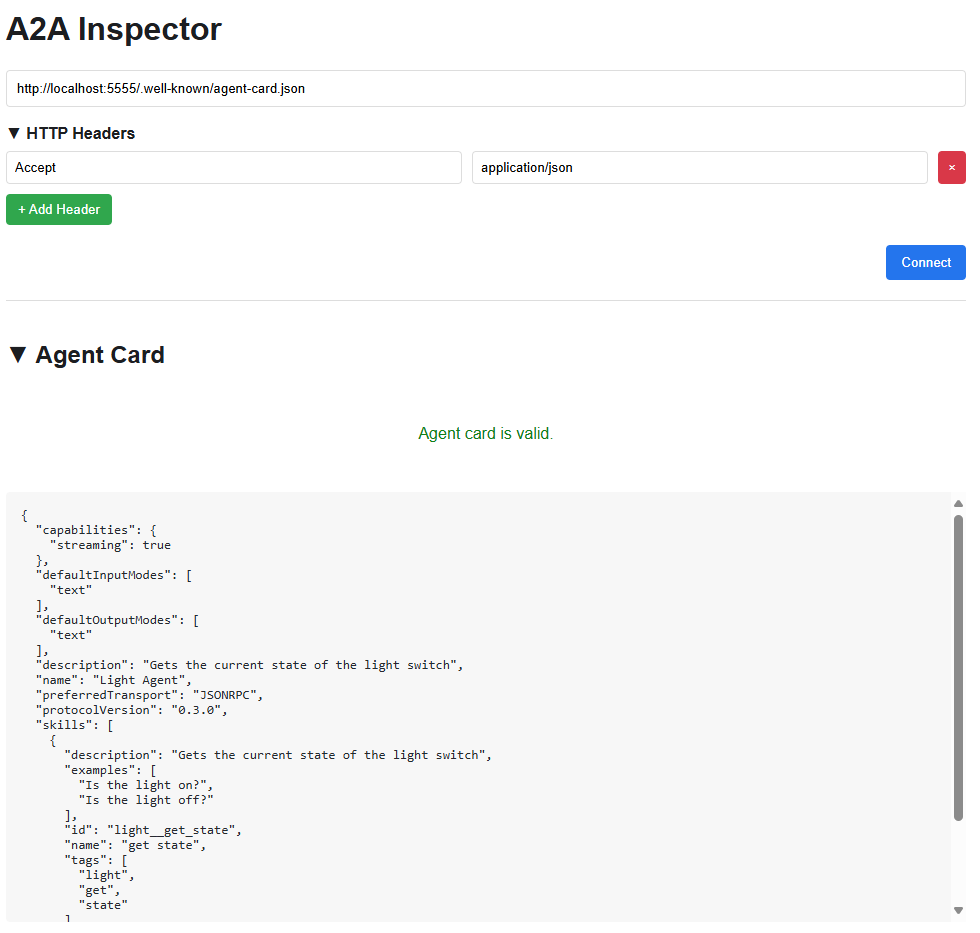

# semantic-kernel-sampler

Semantic-Kernel monorepo sampler

## R&D

TODO

### a2a-inspector

#### Setup

```bash
# installs gil
$> bash scripts/pip/upgrade.ba.sh

# git clone a2a-instpector ./repositories
$> bash scripts/gil/clone.ba.sh

$> cd repositories/a2a-inspector
```

##### python

```bash
$> uv venv
```

- Windows: `$> source .venv/Scripts/activate`
- linux: `$> source .venv/bin/activate`

```bash
$> uv sync
```

Then see [Setup and Running the Application](https://github.com/a2aproject/a2a-inspector?tab=readme-ov-file#setup-and-running-the-application)

##### frontend

```bash
$> npm install
```

#### Run

See [Run the Application](https://github.com/a2aproject/a2a-inspector?tab=readme-ov-file#3-run-the-application)

```bash
$> bash ./run.sh
```

#### Usage

**Connect**:



**Chat**:


## Resources

### GitHub

- [`microsoft`](https://github.com/microsoft) / [`semantic-kernel`](https://github.com/microsoft/semantic-kernel)
- [`a2aproject`](https://github.com/a2aproject) /
  - [`A2A`](https://github.com/a2aproject/A2A)
  - [`a2a-samples`](https://github.com/a2aproject/a2a-samples)
  - [`a2a-inspector`](https://github.com/a2aproject/a2a-inspector)

### Java

- [Java Frameworks You Must Know in 2024](https://blog.jetbrains.com/idea/2024/04/java-frameworks-you-must-know-in-2024/)

### Medium

- [Setting Up ESLint and Prettier for a TypeScript Project](https://medium.com/@robinviktorsson/setting-up-eslint-and-prettier-for-a-typescript-project-aa2434417b8f)
